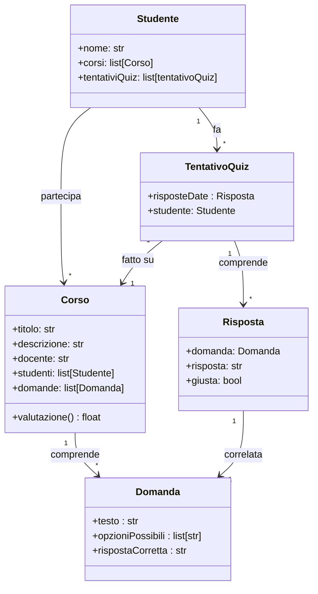

<!-- Sistema Quiz per Corsi Online
Un'istituzione educativa vuole implementare un sistema di quiz online per i propri corsi. 
 Ogni corso ha un quiz associato che gli studenti devono completare per verificare il loro apprendimento. 
 Il sistema deve gestire i corsi, gli studenti e i loro tentativi di completare i quiz.

I corsi sono unità didattiche individuali, ciascuna con un titolo, una descrizione e un docente responsabile. 
 Gli studenti possono iscriversi a più corsi e ogni corso può avere più studenti iscritti. Per ogni corso è previsto un quiz di valutazione.

I quiz sono composti da diverse domande a scelta multipla. Ogni domanda ha un testo, una lista di opzioni possibili e una singola risposta corretta. 
 Il sistema deve poter valutare le risposte degli studenti e calcolare un punteggio finale, verificando se è stato raggiunto il punteggio minimo per il superamento.

Il sistema tiene traccia di ogni tentativo di quiz effettuato dagli studenti (QuizAttempt), registrando le risposte date, il punteggio ottenuto e se il quiz è stato superato. 
 Per ogni tentativo, il sistema deve valutare le risposte fornite (attraverso il metodo valutaRisposte che restituisce il punteggio totale) e verificare il superamento del quiz 
 (tramite il metodo verificaSuperamento che controlla se il punteggio raggiunto è sufficiente).
 -->
