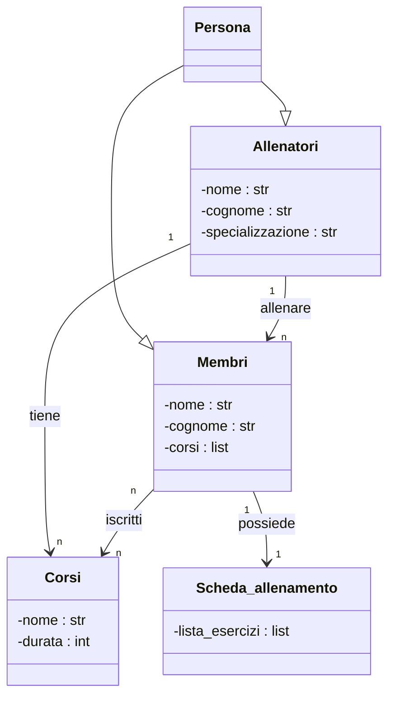

```mermaid
classDiagram
    class Allenatori{
    -nome : str
    -cognome : str
    -specializzazione : str
    }
    class Membri{
    -nome : str
    -cognome : str
    -corsi : list
    }
    class Corsi{ 
    -nome : str
    -durata : int
    }
    class Scheda_allenamento{
    -lista_esercizi : list
    }

    Allenatori "1" --> "n" Membri : allenare
    Membri "n" --> "n" Corsi : iscritti
    Allenatori "1" --> "n" Corsi : tiene
    Membri "1" --> "1" Scheda_allenamento : possiede
    Persona --|> Allenatori 
    Persona --|> Membri 

    
```