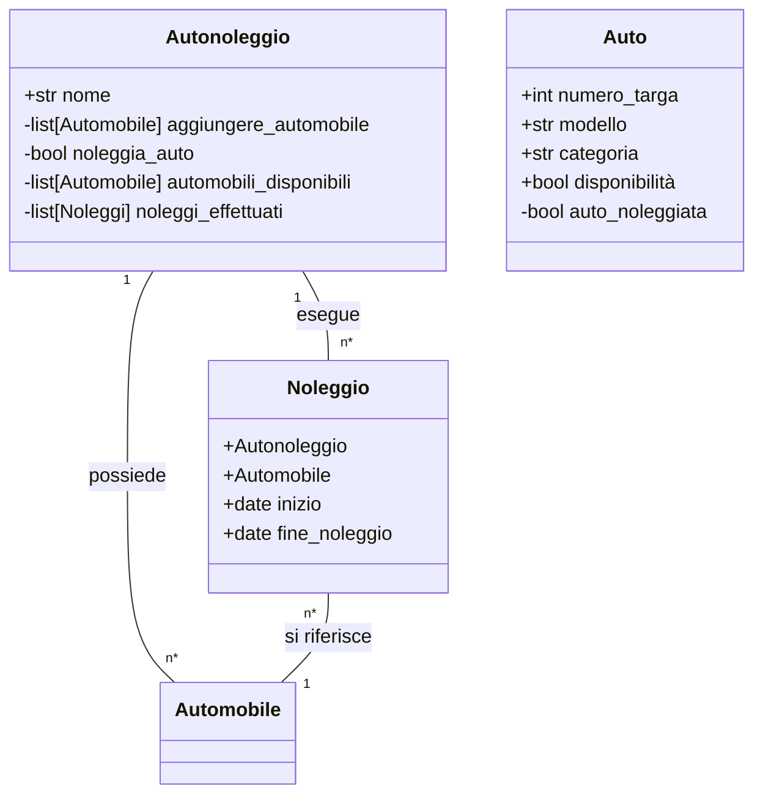

```mermaid
classDiagram
    class Autonoleggio{
        +str nome
        
        
        -list[Automobile] aggiungere_automobile
        -bool noleggia_auto
        -list[Automobile] automobili_disponibili
        -list[Noleggi] noleggi_effettuati

    }

    class Noleggio{
        +Autonoleggio
        +Automobile
        +date inizio
        +date fine_noleggio
        

    }

    class Auto{
        +int numero_targa
        +str modello
        +str categoria
        +bool disponibilità
        -bool auto_noleggiata
         
    }
    Autonoleggio "1" -- "n*" Noleggio : esegue
    Autonoleggio "1" -- "n*" Automobile : possiede
    Noleggio "n*" -- "1" Automobile : si riferisce


    
```