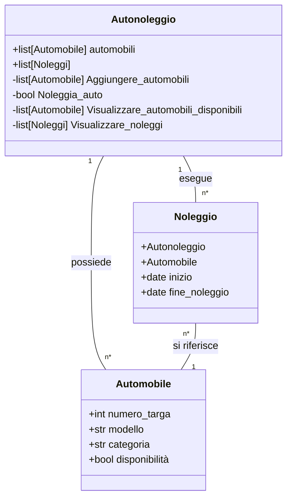

```mermaid
classDiagram
    class Autonoleggio{
        +list[Automobile] automobili
        +list[Noleggi]
        
        -list[Automobile] Aggiungere_automobili
        -bool Noleggia_auto
        -list[Automobile] Visualizzare_automobili_disponibili
        -list[Noleggi] Visualizzare_noleggi

    }

    class Noleggio{
        +Autonoleggio
        +Automobile
        +date inizio
        +date fine_noleggio

    }

    class Automobile{
        +int numero_targa
        +str modello
        +str categoria
        +bool disponibilità
         
    }
    Autonoleggio "1" -- "n*" Noleggio : esegue
    Autonoleggio "1" -- "n*" Automobile : possiede
    Noleggio "n*" -- "1" Automobile : si riferisce


    
```