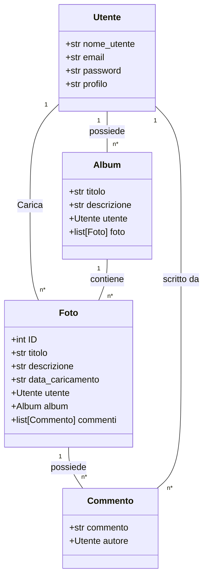

```mermaid
classDiagram
    class Utente{
            +str nome_utente
            +str email
            +str password
            +str profilo

        }
    
    class Foto{
            +int ID
            +str titolo
            +str descrizione
            +str data_caricamento
            +Utente utente
            +Album album
            +list[Commento] commenti
        }
    
    class Album{
            +str titolo
            +str descrizione
            +Utente utente
            +list[Foto] foto
        }
    
    class Commento{
            +str commento
            +Utente autore
    }
    
    Utente "1" -- "n*" Foto : Carica
    Foto "1" -- "n*" Commento : possiede
    Commento "n*" -- "1" Utente : scritto da
    Album "1" -- "n*" Foto : contiene
    Utente "1" -- "n*" Album : possiede


    
```